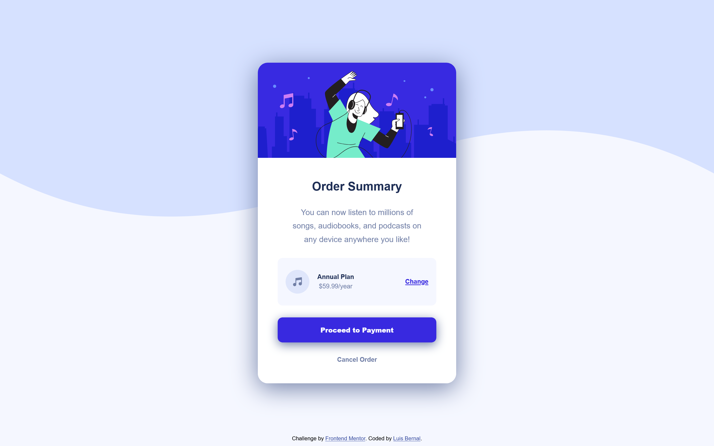

# Frontend Mentor - Order summary card solution

This is a solution to the [Order summary card challenge on Frontend Mentor](https://www.frontendmentor.io/challenges/order-summary-component-QlPmajDUj). Frontend Mentor challenges help you improve your coding skills by building realistic projects.

## Table of contents

- [Overview](#overview)
  - [The challenge](#the-challenge)
  - [Screenshot](#screenshot)
  - [Links](#links)
- [My process](#my-process)
  - [Built with](#built-with)
  - [What I learned](#what-i-learned)
  - [Continued development](#continued-development)

## Overview

### The challenge

Users should be able to:

- See hover states for interactive elements

### Screenshot

### Links

- Solution URL: [https://github.com/FrontendMentor-Lecap/Order-Summary-Component-Main]
- Live Site URL: [https://frontendmentor-lecap.github.io/Order-Summary-Component-Main/]

## My process

### Built with

- Semantic HTML5 markup
- CSS custom properties
- Flexbox
- Mobile-first workflow

### What I learned

In this challenged I practiced flexbox and widths. By assigning different widths to parent elements I can control the aspect of the whole section or card.
I also practiced active states with the `:hover` selector in the `<a>` and the button.

### Continued development

I would like to improve with `::before` and `::after` pseudo selectors, to place images or icons around another item.
